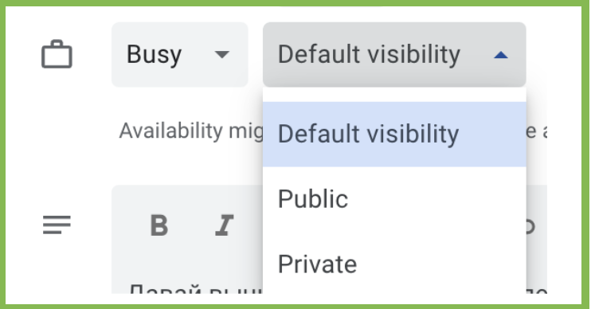
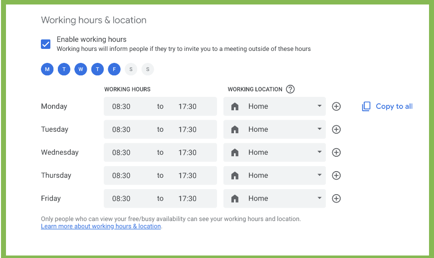
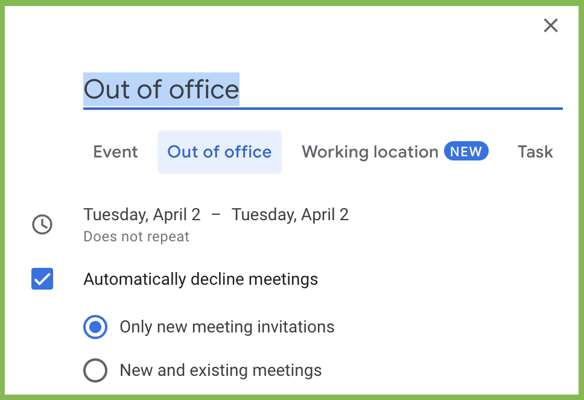
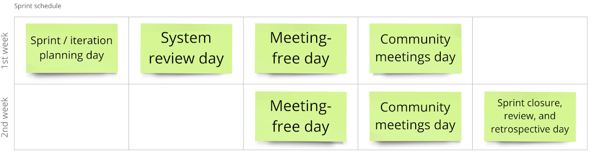

# Communication Principles

## Communication Tools

The following tools are used for communication:

* Slack: our primary platform for internal communication;
* Gmail: used for formal communication, both with external partners and within the company;
* Google Meet: the main tool for virtual meetings.

## Google Calendar Rules

* **time zone**: schedule all meetings in **GMT+02:00 (Eastern European Time, Nicosia)**, regardless of your location;
* **holiday calendars**: add the following holiday calendars to your personal calendar: Cyprus holidays and Kazakhstan holidays;
* **organization events calendar**: add these organization event calendars by selecting the relevant checkboxes next to these calendars on the left side panel:
  * prod & tech events;
  * community events.

## Personal Calendar Rules

* meetings in the calendar are updated at least for the current week;
* working hours are set during which it is permissible to schedule meetings;
* vacations and days off are reflected in the calendar in the format of an "Out of Office" event;
* a response is given to all received invitations at least one day before the meeting:
  * yes — the invitation is accepted. if I am late, I will notify in the Notes;
  * maybe — I might attend, but the meeting can start without me;
  * no — I will not attend;
* your schedule should be visible: separately set the visibility as "default" for working events and "private" for events that don't relate to working hours and you do not wish to disclose their meaning (for example, visit to a doctor, kindergarten, etc.);

implementation: settings → your email calendar → share with specific people or groups.

### Setting Working Hours

set "home" or "office" location: settings → working hours & location.

### Setting Unavailable Hours

when you're unavailable during working hours, "out of office" should be set in your calendar.

## Effective Meetings

* **purpose**: always mention the meeting purpose, which is the desired outcome or decision you aim to achieve;
* **title**: set a clear meeting title that reflects the purpose or theme;
* **agenda**: if multiple topics or decisions need to be discussed, set an agenda to ensure the meeting achieves its purpose;
* **preparatory materials**: attach any necessary materials to the meeting description to support preparation;
* **time and duration**: the recommended standard meeting time is 25 or 50 minutes to allow a short break between consecutive meetings;
* **attendees**: invite all essential participants to achieve the meeting's purpose, marking others as optional.

## Scheduling Regular Team Meetings

all regular team meetings should be scheduled in the team calendar / cluster / unit calendar. recommended durations are as follows:

* daily stand-up: 15 minutes;
* sprint planning: 50 minutes;
* sprint retrospective: 50 minutes;
* sprint review: 25 minutes. an internal sprint review could be conducted at once before the retrospective.

the schedule for product teams follows the cadence below.

## Rescheduling of Shared Meetings

rules for rescheduling shared events due to public holidays:

* if a regular event for the cluster / division falls on a public holiday in Kazakhstan, the event will only be held with participants from Cyprus;
* if a regular event falls on a public holiday in Cyprus, the event will be rescheduled to the nearest working day after the holiday;
* teams are responsible for managing the rescheduling of their team events and may adhere to their agreements.