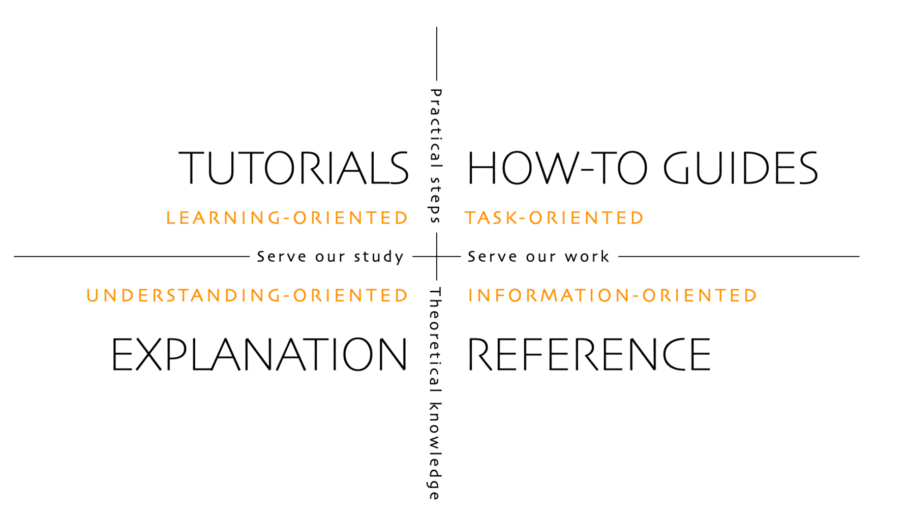

# About this Guideline

This section provide guidelines to write clear and consistent documentation.

> **NOTE**
>
> This guide contains recommendations, not rules. Do not use it when doing so does not improve the content.

## What is Technical Documentation

When we mention "documentation," we’re referring to any additional text that an engineer must write as part of their work. This includes not only separate documents but also code comments. In fact, the majority of documentation written by engineers at inDrive takes the form of code comments.

The tech documentation is divided by:

* **external (customer facing)** — helping external users of a product, or developers working with it, understand how the product works;
* **internal** — primarily intended to share knowledge about a product or system within an organization so that other developers can contribute or help to maintain it.

>**NOTE**
> 
> In this guideline, we do not consider external documentation for the external users of our product, as it is not the responsibility of the tech division.

### Types of Internal Tech Documentation

* `README.md` files (component / service launch);
* tech documentation for components / services (including docs for tools, libraries);
  * how-to guides;
  * `CONTRIBUTING` file on how to contribute to a repo;
  * team tech processes having impact on the general development procedure;
  * run books;
  * architecture decision record;
* diagrams:
    * PlantUML: sequence diagrams, ER-diagrams, system and container diagrams;
    * Mermaid diagrams.
* GraphQL;
* Swagger;
* documentation built from code comments, usually added to `.md` files by snippets;
* dependencies (dependency graph).

## Best Practices for Writing Tech Documentation

### Consider the Audience

Always consider for whom a document is written for:

If it is **intended for end users** — it should be written in plain language so that a reader can immediately understand it.

If it is **intended for stakeholders** — it is important to avoid complex jargon, technical jargon, or acronyms that they may not be familiar with.

If it is **intended for technical experts** — use terminology they are familiar with and give them the technical details they need to do in their work. Even then, keep things as simple as possible and present only the information that is absolutely necessary.

### Define a Doc Type

To define the type of tech docs, the ["Diátaxis documentation framework"](https://diataxis.fr) is used as a part of the 'docs-as-code' approach where the **user’s needs** are placed centre-stage when creating a document.

A clear advantage of organising material this way is that it provides both **clear expectations (to the reader) and guidance (to the author)**. It’s clear what the purpose of any particular piece of content is, how it should be written, where it should be placed.

**The definition of the type and writing style of docs** requires answering a user oriented questions:

|  | Tutorial | How-to-guide | Reference | Explanation |
| --- | --- | --- | --- | --- |
| What the docs do? | Introduce, educate, lead | Guide, demonstrate | State, describe, inform | Explain, clarify, discuss |
| Answers the question | “Can you teach me to…?” | “How do I…?” | “What is ...?” | “Why…?” |
| Oriented to | Learning | Tasks | Information | Understanding |
| Purpose | To allow the newcomer to get started | To show how to solve a specific problem | To describe the tech part | To explain |
| Form | Lesson | Series of steps | Dry description | Discursive explanation |
| Analogue (example of application) | Teaching to code in Java | Step-by-step coding of a Telegram | Reference article on Java | Article on Java coding in digital world |
| **inDrive docs types on Documentary Platform** | **"Handbook"** (any type)  / **Playbook** | **"Contributing", "How-to-guide", "User Guide"** | **"API", "Release Notes", "Service Description", "Readme"** | **"Tech Blog Post"** |

### Keep the Docs Up to Date

Proper docs maintenance is very important, as outdated or inconsistent content automatically loses its value.

The update process shall be ensured on the platform used for the rendering of data and docs.

Learn more about the 'docs-as-code' approach [here](documentation-workflow.md).

### Collaborative Documentation Culture

The collaborative workflow of a tech writer and engineers (and not only) is described [here](documentation-workflow.md).

