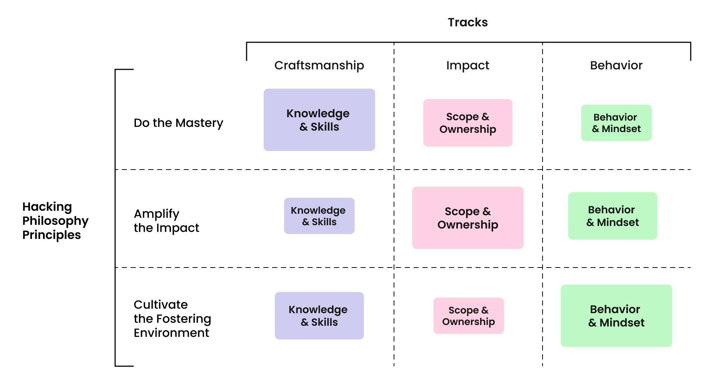

# Crafters Model

## Model Principles

* do the mastery;
* amplify the impact;
* cultivate the fostering environment.

| Principle              | Description                                                                                                                                    | Examples                                                                                                                                                                                                                                                                        |
|------------------------|------------------------------------------------------------------------------------------------------------------------------------------------|---------------------------------------------------------------------------------------------------------------------------------------------------------------------------------------------------------------------------------------------------------------------------------|
| **Do the mastery**     | We **strive** for excellence in our field. We achieve high levels of quality in our work, making significant contributions to product creation | **Be like**: "As a front-end developer, I have basic mastery of the backend and write simple code for it now.".   **Avoid**: "I improved my service, but did not take into account the dependence of other services on it my change disrupted the services of my colleagues" |
| **Amplify the impact** | We **engage** in understanding how and why our product works. We **invest** our time into meaningful outcomes                                  | **Be like:** "I took part in field research, and the data I collected helped to ..."                                                                                                                                                                                            |                                     

## Engineering Tracks

For each principle, we can identify correlated tracks that highlight different aspects of the principle.

We have extracted three tracks, each of which is important for every principle, but they contribute to them at different levels.

For example, the craftsmanship track contributes most significantly to the "Do the Mastery" principle (as it's obviously focused on mastering skills). However, other tracks, such as Impact and Behavior, also play a significant role in shaping this principle.

You can see below how principles and tracks are related to each other.

### Craftsmanship: Complexity over Creativity

| Craftsmanship level | Description                                                                                                      | Employee level  |
|--------------------|------------------------------------------------------------------------------------------------------------------|-----------------|
| **C1**             | Solves specific task with fixed scope using standard company's approaches                                        | Junior          |
| **C2**             | Implements specific scenarios with fixed scope using set of standard company's approaches                        | Middle          |
| **C3**             | Delivers business value by adjusting company's set of standard approaches or bringing new ones from the industry | Senior, EM, HoE |
| **C4**             | Adopts approaches from the industry to deliver business value in complicated scenarios                           | Staff           |
| **C5**             | Crafts innovate solutions in the realm of unknown that have  no analogues in the industry                        | Principal       |

### Impact: Ownership over Scope

| Impact level | Description                                                                                  | Employee level |
|--------------|----------------------------------------------------------------------------------------------|----------------|
| **I1**       | Contributes to overall results by implementing tasks                                         | Junior         |
| **I2**       | Processes feature delivery                                                                   | Middle         |
| **I3**       | Drives product development                                                                   | Senior         |
| **I4**       | Leads vertical-affecting processes and solution discoveries for a product                    | Staff, EM      |
| **I5**       | Takes responsibility to discover vertical-affecting solutions and to reveal product problems | HoE, Principal |
| **I6**       | Takes responsibility to solve inDrive-wide problems                                          | Director       |

### Behavior: Effect on People

| Behavior level  | Description                                                           | Employee level         |
|--------|-----------------------------------------------------------------------|----------------|
| **B0** | No specific expectations                                              | Junior         |
| **B1** | Rarely influences team members                                        | Middle         |
| **B2** | Affects team members, influences related teams                        | Senior         |
| **B3** | Guides the team, affects related teams                                | Staff          |
| **B4** | Guides own team, affects related teams, influences the entire cluster | EM             |
| **B5** | Guides teams in the cluster, influences the entire division           | HoE, Principal |
| **B6** | Affects the division, inspires the entire company                     | Director       |

### Engineering Ladder

For each engineering position, we can suggest a combination of different tracks in varying amounts. Using this approach, we can describe each position as a set of expectations across different tracks.

| Employee level | Craftsmanship | Impact | Behaviour  |
|----------------|--------------|--------|------------|
| Junior         | C1           | I1     | B0         |
| Middle         | C2           | I2     | B1         |
| Senior         | C3           | I3     | B2         |
| Staff          | C4           | I4     | B3         |
| EM             | C3           | I4     | B4         |
| HoE            | C3           | I5     | B5         |
| Director       | C4           | I6     | B6         |
| Principal      | C5           | I5     | B5         |

To get more information refer to the detailed [career ladder](ic-track.md) description.

