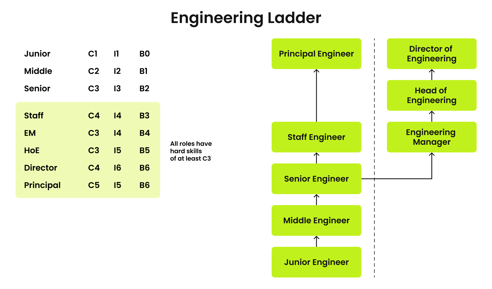

# Engineering Ladder

To address all growth needs, two career ladders are defined: the Engineer and Manager ladders. Both ladders share a common starting point but then split into two distinct branches.

## [Engineer Track](ic-track.md)  

* Junior Engineer;
* Middle Engineer;
* Senior Engineer;
* Staff Engineer;
* Principal Engineer.

## [Manager Track](manager-track.md)  

* Engineering Manager;
* Head of Engineering;
* Director of Engineering.
