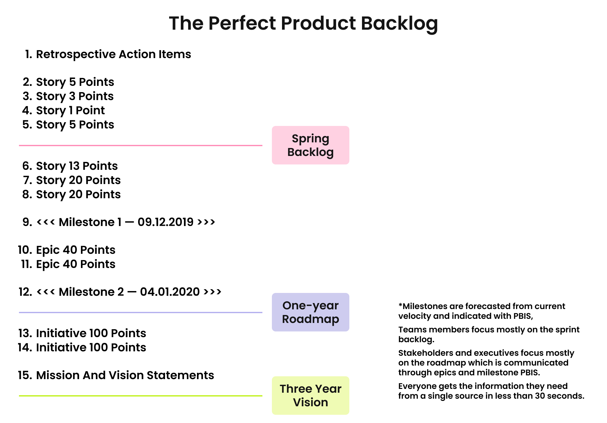

# Backlog Organization

> **Product backlog** is an ordered list of work tasks, arranged in order of importance / priority for the product team. It is compiled based on the product roadmap / vision and OKR.

The most important decomposed and estimated tasks are located at the beginning of the product backlog so that the team understands what work should be done first. The development team independently chooses tasks from the product backlog, correctly assessing its resources in the sprint.

## Responsible for Backlog

Despite the fact that a Product Manager is responsible for the backlog, the entire team is involved in the process. The success of the backlog depends on the contribution and feedback provided by customers, designers, and the development team. Together, they must achieve an optimal workload between all participants and ensure the delivery of the product.

## Jira Backlog Management

A correctly organized and visualized backlog:

* facilitates sprint and release planning;
* ensures each team member understands what the team will be working on and how each task impacts specific metrics or key results;
* makes the team's work predictable for all stakeholders.

**1. The first and most important step is to formalize the Epic entity in Jira.**

To do this, go to the project roadmap, having previously identified the important Epics for the quarter. These Epics can be either product-related or technical. It is a good practice for Epics to be tied to the team's KR and indicate which metric we aim to impact.

**2. Each Epic should be split into Stories or Enablers.** 

The implementation of which can then be easily tracked on the map. Here you can also create dependencies between tasks.

Story descriptions should be in plain language, indicating the context of the work. Once the task has passed the PBR, we add acceptance criteria and an estimate.

> **IMPORTANT**
>
> Each story must be tied to a specific Epic so that the team understands which part of the functionality and metrics it affects.

**3. It is also possible to create a static sprint in Jira, such as "Ready for Dev" or "Ready for PBR" to make it easier to navigate the canvas of tasks.**

It helps to track the replenishment of the backlog and pre-delivery. It will also be easier for the team to check the tasks before moving them to the "Ready for Development" status because we must make sure that every task meets the definition of done.

Planning takes place as quickly as possible because all tasks are already prepared for the sprint, and we only need to assess our capacity and transfer tasks to the future sprint.

## Recommended Practices for Backlog Management

* Epics for developing product features should be linked to a Unified Product Discovery task from the Jira Discovery project and include a link to a Product Requirement Document;
* Epics should be split into several Stories or Enablers, which can be further divided into sub-tasks;
* Epics for tech investment should contain a field Backlog Type = Tech Investment;
* after the backlog is created, it is important to regularly adjust it as functionality is completed and closed;
* the Product Manager, along with an Engineering Manager, should regularly review the backlog before each PBR to refine priorities and make changes based on research findings and feedback.
* when the backlog becomes too large for the team's resources even in the long term, tasks that will never be queued can be rejected;
* Stories and Enablers taken into a Sprint Backlog should meet the Definition of Ready criteria.

> **IMPORTANT**
>
> It is important to maintain the cleanliness and structure of the backlog in Jira. This is the key to success in delivering value from the team.

## Sprint Backlog

For the sprint backlog, the team is responsible for replenishing it. The team must ensure that most of the work tasks are united by the goal of the sprint, which carries value for the end user. They should also check the feasibility and transparency of the sprint goal to ensure all tasks can go through the development life cycle in one iteration.

> **NOTE**
>
> More often, product tasks are included in the sprint goal, and this takes up about 50-60% of the team's capacity.
>
> We also recommend leaving 20% of the sprint for technical investments.

**Tech investments** include technical tasks selected by the team from the technical roadmap and tech OKR of the team, cluster, and the entire company. These can be tasks for working with architecture, research, technical debt, and technical metrics. We create such tasks under the Enabler entity.

The remaining part of the team's capacity can be left for meetings, operational tasks, or bugs.

> **CAUTION**
>
> It is better to keep in mind the following common mistakes:
>
> * a Product Owner prioritizes a backlog before the project starts, but does not adjust it as information comes in from developers and stakeholders;
> * the team adds to the backlog only those tasks that are oriented to customers;
> * the backlog is stored as a local document and is rarely passed on to anyone, so stakeholders do not know about changes.
