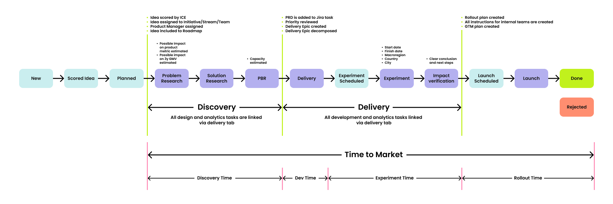
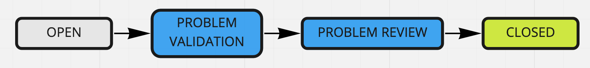

# Discovery

> **NOTE**
>
>The current approach serves as an example. We do not claim that it will be effective in each of the teams, but it can be a good basis for starting to build your approach.

## Discovery Process

Discovery process is the heart of product development and product team work.

The product discovery is the part of the value delivery process and is aimed at searching for ideas, forming and validating hypotheses, searching for growth opportunities for the product, evaluating and forecasting the effect for the business and customers, analyzing the result obtained and making operational management decisions. The discovery process allows you to answer two key questions "Why are we doing?" and "What are we doing?" (as well as make the first priority clarity in answering the question "How are we doing?").

To conduct the discovery process:

1. Collect and validate user issues.
2. Define key product and feature metrics.
3. Formulate a product hypothesis and validate it as quickly as possible.
4. Improve the user experience.
5. Minimize uncertainty before the delivery process.

Below is the preliminary flow of the discovery process.

## Main Artefacts

* the list of issues: the list of issues is a list of problems that users face when interacting with the product. The sources of user problems can be observations, metrics and funnels, feedback from users and support services, trends market research, interviews, surveys, hypotheses;
* backlog of issues: the backlog of validated issues (the definition of done of the validation process is below);
* backlog of experiments: the backlog of experiments, including quantitative / qualitative research, the implementation of which should improve the pre-selected product metrics. Ideally, the backlog of experiments should consist of product hypotheses.

To formalize the discovery process, weekly scrum-like sprints are used. The main benefits of this approach are:

* focusing on key issues and tasks amid a large number of discovery items;
* establishing a system that enables rapid experimentation;
* continuously improving processes for discovery development.

>**NOTE**
> 
> 1. The increment of the discovery sprint does not directly bring value to the end user.
> 2. The discovery team understands that part of the experiments does not "fit" into the weekly format (which does not exclude the desire to constantly work on accelerating the conduct of experiments).
> 3. Discovery sprints are held without daily, since the team can synchronize on the achievements of the sprint goals in asynchronous mode; retrospectives are held "on request" (but no less than one event per month).

## Discovery Sprint: Description of Events

1. Discovery Sprint Review: surprisingly, for better process understanding, it’s often best to start from the end. The possible increments that can result from a Discovery Sprint include:
   * validation of the user's issue;
   * product experiment design;
   * product experiment review (primarily alignment with the stated product metrics);
   * product artifacts (such as CJM, user segmentation, Lean Canvas, etc.);
   * artifacts for delivery preparation (all knowledge necessary to meet the DoR criteria for the delivery sprint);
   * updates to product goals and the metrics tree.

   The review is conducted by all discovery team members, with key stakeholders and members of the delivery team also participating. The event should last no more than 30 minutes. If reviewing a part of the discovery sprint increment takes longer, an additional meeting is scheduled. For instance, if the goal of the discovery sprint was to prepare artifacts for the delivery sprint, then the artifact discussion can occur within the PBR.

2. Discovery Sprint Planning: this 1-hour event involves the discovery team formulating the sprint’s goal, agreeing on high-level strategies to achieve it, and defining the additional scope of tasks (including analytics, design, and experiments) to be completed within the sprint. The sprint goal typically involves delivering one (or in rare cases, several) increments of the discovery sprint.

3. Retrospective: the retrospective should be conducted similarly to those in delivery sprints: the current discovery processes and team interactions are reviewed, and improvement points are identified. It is held at least once per month and lasts at least 1 hour. A best practice is to hold a retrospective after a sprint where none of the sprint goals were achieved.

## Discovery Sprint: Issue Validation Process
 
To understand whether the team should work on a particular problem, you need to:

* formulate the problem of a certain technical assignment according to any suitable framework (for example, Jobs To Be Done). At this stage, it may turn out that the problem is insignificant or is not a problem at all;
* understand the volume of users facing this problem;
* determine which product metrics (target and indirect) and to what extent (predictably) will change after the problem is resolved.

The specified points are the definition of done for the successful validation of the problem.

## Discovery Sprint: Description of Experiment Process

The experiment is a process of designing a solution to a problem and quickly confirming the effectiveness of this solution. The experiment is a fairly broad entity that includes processes from "corridor" testing of layouts to MVP (or prototype) of features. The main value of the experiment is to save resources on creating something that will not ultimately bring any value to the client and product.

>**IMPORTANT**
> 
> If the members of the product team are 100% sure that they know how to solve the user's problem, a need for an experiment disappears. But there are not so many such cases in practice, because any product is created in the conditions of a complex environment.

Descriptions and criteria of success for each status:

Here’s a refined version of the text:

**Experiment design** — design of the experiment. At this stage, the team should define the following: the experiment methodology (how we will determine if a potential feature has an impact, and what metrics define success), the operational logic, visualizations (layouts, if needed), the experiment plan (locations, user segments), and risk management—identifying any risks associated with the experiment and establishing a “rollback” plan in case of failure. These criteria form the DoD for the `@design` status.

**Ready for experiment** — a buffer zone where the solution awaits development after its design phase is completed.

**Experiment development** — development of the proposed solution. The DoD for this status is a fully developed solution, ready for testing.

**Ready for launch** — a buffer zone awaiting the experiment’s launch.

**Experiment launch** — execution of the experiment with participation from a pre-defined target audience.

**Review** — evaluation of the experiment results for alignment with selected product metrics and (if available) gathering of feedback from respondents.