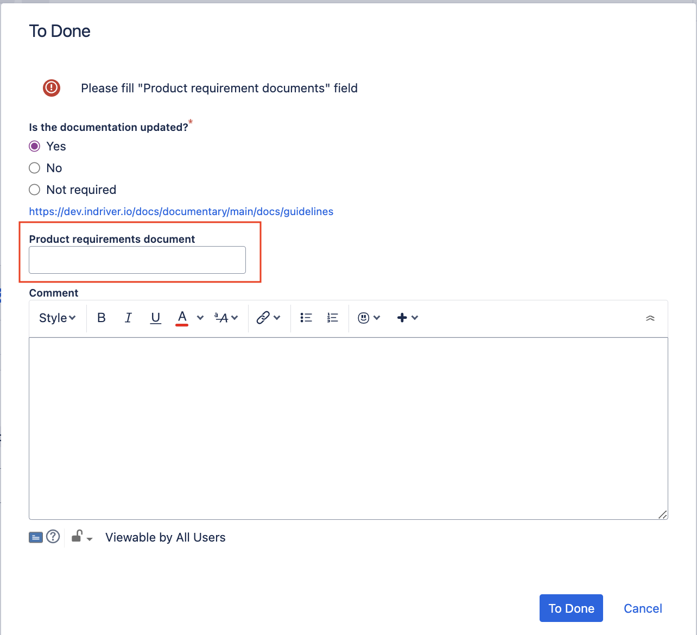

# Unified Discovery Process

The product process starts in the Unified Discovery Process (UPD).

## Process Steps

A UPD has the following status model:

### New

A UPD task is created.

### Scored

Score the UPD by specifying:

* start and launch dates;
* move a UPD to "Planned" status.

### Planned

* create a product requirement document (PRD) by using a template;
* link PRD to the idea;
* move idea to "Discovery" status.

### Discovery

* create all necessary tasks for all participants via “Delivery” tab;
* monitor and sync on progress via Idea’s “Delivery” tab;
* once the delivery is planned to the sprint move the idea to "Ready for Development" and then to "Delivery" status.

### Delivery

* monitor the delivery progress;
* help the dev team to overcome obstacles;
* schedule an experiment.

Once the Idea is developed and experiment designed, specify:

* experiment start date;
* experiment finish date;
* macro region;
* countries;
* cities.

>**NOTE**
> 
> At this stage a PRD should be attached to the UPD task. The link to the PRD should be specified in the Product Requirement Document field or in the description.

### Experiment Scheduled

* wait for experiment start date;
* launch the experiment;
* move Idea to Experiment stage.

### Experiment Started

* wait till you have enough data to analyse and make a conclusion on the experiment;
* move Idea to "Impact Verification" status.

### Impact Verification

* calculate experiment results;
* attach experiment details to PRD;
* make clear experiment conclusion.

In case the experiment successful:

* agree with stakeholders on launch plan;
* actualise the finish date — date when the feature will be fully launched;
* move idea to "Launch Scheduled" status.

### Launch Scheduled

* move on according to the Launch Plan;
* ensure all necessary artifacts are prepared (GTM plan, instructions, etc);
* once everything is ready, start the launch and move the idea to "Launch" status.

### Launch

* monitor the launch progress;
* once the feature is launched, move the UPD to "Success" status.

## Product Requirement Document

In our company a PRD is a mandatory detailed description of what a product needs to achieve, including its functions, features, goals, and expected results. It's all required for us to understand what are the roots for each developed features and why this or that decisions are taken.

PRD is used to increase discoverability of documentation in the organization.

It is designed to be used and referenced by:

* Product Stream Owners;
* Growth Stream Owners;
* Developers and Engineering Managers;
* Product Analysts;
* Designers.

The PRD includes the following basic elements in the structure:

* header with general information on PRD status, owners, etc.;
* needs (including metrics);
* solution (including BPMN Notation / flow chart, user story or JTBD, design, analytics, system requirements (including functional and non-functional requirements), acceptance criteria;
* implementation (decision making, experiments, notes).

For now, the PRD should be stored in the product workspace on Confluence in a relevant stream section.

Feature stakeholders are the designated owners of their PRDs. They are accountable for:

* ensuring the document is accurate and comprehensive;
* regularly updating the PRD as new information becomes available (including availability in Jira tasks);
* validating the information to maintain the integrity of the document.

PRD creation and update:

* a PRD should be created using a predefined template;
* PRD shall be created during the Delivery stage of the product process and is subject to update during the entire process. Some parts of this document can be updated when a task is already delivered to the engineering teams.

## Verification of PRD Availability

The availability of a PRD link is checked in each feature task.
A link to the product documentation should be added to the designated field within the feature task.

This verification is enabled for Software Jira projects within the product teams and is applied to issues of type "Story," "Task," and "Epic."

The field is checked when a task moves to the "Done" or "Close" status.

Verification is not required for tasks with the "TechDebt", TechInvestment and "Backlog" types.