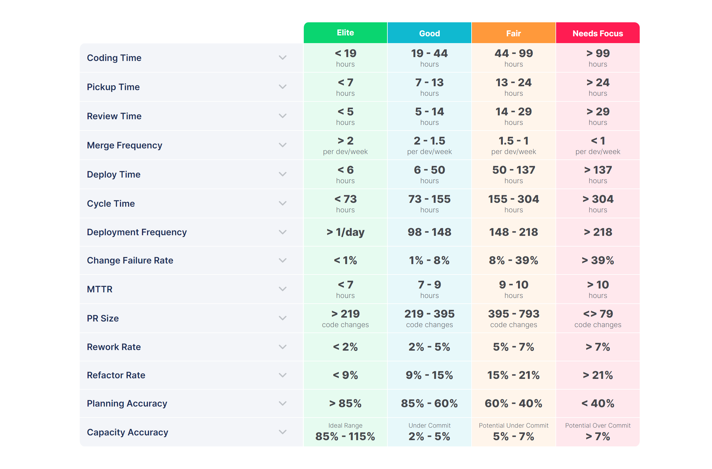
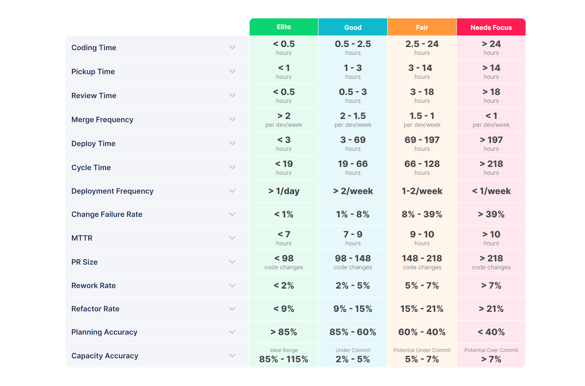

# Developer Experience Metrics

The goal of the Engineering Platform Unit is to enhance development efficiency by improving engineers' overall experience. The Unit uses various metrics to evaluate its performance, with the primary ones being the Developer Experience Index (DevEx Index) and the Engineering Satisfaction Index (ESI).

## Developer Experience Index (DevEx Index)

The purpose of the index is to assess the speed and efficiency of the software development cycle, highlighting areas that require priority attention. A distinctive feature of the index is that it is based on [LinearB Engineering Metrics Benchmarks](https://linearb.io/resources/engineering-benchmarks), ensuring alignment with global best practices rather than being developed in isolation.

### Collection Method

> **CAUTION**
>
> Metrics for the index are not currently being collected, and various tools are being explored to enable their collection. In the future, information on how and where these metrics can be accessed will be available here.

### Calculation Formula

The index consists of several components. For each component within the index, a score is assigned based on our standing, as follows:

* `Need Focus` is 0;
* `Fair` is 1;
* `Good` is 2;
* `Elite` is 3.

After that, the average of all scores is calculated, which is the total index.

> **ΝΟΤΕ**
> 
> **Example**: our metrics for `Coding Time`, `Pickup Time`, `Review Time`, and `Merge Frequency` fall in the **Good zone**. Metrics like `Deploy Time`, `Cycle Time`, `Deployment Frequency`, `Change Failure Rate`, and `MTTR` are in the **Fair zone**, while the remaining metrics are in the **Need Focus zone**. This results in four metrics with a score of 2, six metrics with a score of 1, and five metrics with a score of 0, producing a **DevEx Index of 0.9**.

The index is calculated both at the company-wide level and for individual areas and teams. The metrics underlying the index are evaluated in two ways: using the overall average of all data and the 75th percentile. Further details are provided below.

### Index Components

#### Coding Time

The time from the first commit until a pull request is created is referred to as **Coding Time**. Short coding times typically correlate with low work-in-progress (WIP), smaller pull request sizes, and clear, well-defined requirements.

#### Pickup Time

**Pickup Time** is the duration a pull request waits before a reviewer begins the review process. Low pickup times generally indicate strong teamwork and an efficient, responsive review process.

#### Review Time

**Review Time** is the time required to complete a code review and merge a pull request. Low review times indicate strong teamwork and an effective, streamlined review process.

#### Merge Frequency

The average number of pull or merge requests merged by one developer in one week. Elite merge frequency represents few obstacles and a good developer experience.

#### Deploy Time

**Deployment Time** is the duration from when a branch is merged to when the code is released into production. Low deployment times are often associated with high deployment frequencies.

#### Cycle Time

**Cycle Time** (also known as **Lead Time for Changes**) measures the time it takes for a single engineering task to progress through all phases of the delivery process, from 'code' to 'production'.

#### Deployment Frequency

**Deployment Frequency** measures how often code is released to production. An elite deployment frequency indicates a stable and robust continuous delivery pipeline.

#### Change Failure Rate

**Change Failure Rate** is the percentage of deployments that result in a failure in production.

#### MTTR (Mean Time To Restore)

**Mean Time to Recovery (MTTR)** is the average time required to restore the system or one of its components following a failure.

#### Pull Request Size

**Pull Request Size** is the number of code lines modified in a pull request. Smaller pull requests are easier to review, safer to merge, and are often associated with a lower cycle time.

#### Rework Rate

**Rework Rate** is the amount of changes made to code that is less than 21 days old. High rework rates indicate code churn and serve as an early indicator of potential quality issues.

#### Refactor Rate

**Refactored Work** represents modifications made to legacy code, with LinearB defining code as "legacy" if it has been in the codebase for over 21 days.

**Planning Accuracy** and **Capacity Accuracy** are excluded from the DevEx Index as they reflect team maturity rather than the developer experience itself.

### Engineering Benchmarks

Benchmark data is sourced from LinearB research. The 2023 Software Engineering Benchmarks Report is based on a study analyzing 3.6 million pull requests from 2,800 development teams across 64 countries.

For more details on the study, visit the [LinearB blog](https://linearb.io/blog/engineering-metrics-benchmarks-what-makes-elite-teams).

## Engineering Satisfaction Index (ESI)

The purpose of the index is to evaluate engineers' satisfaction with various aspects of the development process. It helps to pinpoint the most problematic areas that, according to the developers themselves, have the greatest impact on the development workflow.

> **CAUTION**
>
> Based on the study results, a list of targeted initiatives is created to address the identified issues. These initiatives are designed to resolve the most pressing problems impacting the development process, enhancing overall efficiency and satisfaction.

### Collection Method

Metrics for the index are gathered through engineer satisfaction surveys conducted across all areas of development, with mandatory participation from all engineers. The survey is divided into 10 to 12 sections, each covering a specific area of development. Each section includes 3 to 10 mandatory questions scored on a 1 to 5 scale, where 1 represents "completely disagree" and 5 represents "completely agree." At the end of each section, there is also an optional open-ended question, "Why did you score this way?".

> **CAUTION**
>
> Currently, index data is stored in a Google Sheet. This spreadsheet includes index indicators for the full duration of the study, as well as all engineer responses (in anonymous form).

The index is calculated for the company as a whole, as well as for individual areas and teams. Research is conducted on a semi-annual basis.

Here’s the corrected version of the table and text for clarity:

| Stage                              | General Research                                                                                                                                  | Express Research                                                                                                                                  |
|------------------------------------|---------------------------------------------------------------------------------------------------------------------------------------------------|---------------------------------------------------------------------------------------------------------------------------------------------------|
| **1. Survey**                      | Conducted at the end of Q4. Respondents provide and comment on their ratings.                                                                     | Conducted at the end of Q2. Respondents provide and comment on their ratings.                                                                     |
| **2. Information Supplementation** | Series of in-depth interviews with respondents.                                                                                                   | Analysis of rating comments using ChatGPT, focusing on the quantity and tone of mentions of specific development aspects.                         |
| **3. Results Analysis**            | Examination of collected information and grouping of issues.                                                                                      | Examination of collected information and grouping of issues.                                                                                      |
| **4. Initiative Formation**        | Creation of a list of initiatives aimed at resolving identified issues. Prioritization of initiatives and feedback provided to relevant clusters. | Creation of a list of initiatives aimed at resolving identified issues. Prioritization of initiatives and feedback provided to relevant clusters. |

### Calculation Formula

For each question, a mean score is calculated based on engineers' responses. An average score is then determined for each section and each area of focus. The overall average across all areas represents the total index.

### Index Components

The index is composed of the averaged indices from all areas, including Android, iOS, and Backend.
