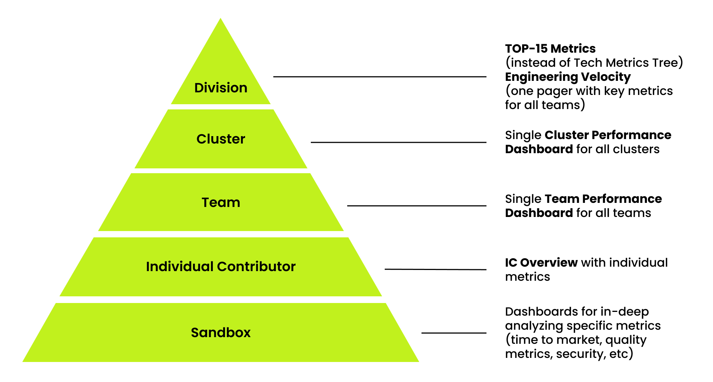

# Single Analytical System

The single analytical system comprises five tiers and includes key metrics from the Prod&Tech division, implementing a systematic approach to metric usage across divisions. The system is designed to achieve the following goals:

* monitor the performance of teams, clusters, and divisions;
* support data-driven decision-making at all levels;
* improve the efficiency of current processes.

The single analytical system serves as:

* the single source of truth;
* the primary point of entry for analyzing key metrics, built on Tableau and datamarts, and aggregating all essential company data sources (e.g., Jira, GitHub, Grafana) or integrating with them;
* a repository of metrics from all organizational levels;
* a resource with a set of dashboards for in-depth analysis of specific metrics (e.g., TTM, lead time, quality metrics, TMM, etc.).

More detailed information is presented in the table:

| №  | Tier                   | Dashboard Name            | Stakeholders                                                          | Where It's Used                                 | Frequency            |
|----|-------------------------|---------------------------|-----------------------------------------------------------------------|-------------------------------------------------|-----------------------|
| 1  | Division               | Top 15 Metrics            | Leadership team, including SMEs, EMs, Principals, Heads, VPs, C-level Managers, Coaches | Strategic meeting                               | Monthly              |
|    |                        | Engineering Velocity      | C-Level Managers, VPs, HoPs, HoEs, Coaches                            | As required                                     | Bi-weekly            |
| 2  | Cluster                | Cluster Performance       | HoPs, HoEs, EMs, PMs, Coaches                                         | POW WOW                                         | Monthly              |
| 3  | Team                   | Team Performance          | EMs, PMs, Coaches                                                     | Team Retrospectives, System Review, Tech insight, planning | Bi-weekly            |
| 4  | Individual Contributor | IC Overview               | EMs, Coaches, HoEs, ICs                                               | 1-1, Performance review                         | As required          |
| 5  | Sandbox                | Discovery Project (UPD), Team Maturity Big Picture, Security (Error budget), Quality, Data Quality, Feature Analysis | C-level Managers, VPs, HoPs, HoEs, EMs, PMs, Coaches, SMEs | Team Retrospectives, System Review, Tech insight, POW WOW | Bi-weekly or monthly |

## Metrics Tiers

### Tier 1 / TOP-15 Metrics

The dashboard enables analysis of key metrics and the overall performance of the division. It serves as the primary tool for monitoring the division’s current performance and is actively used by the division leadership team. Certain metrics are specifically developed and analyzed at the division level (e.g., Efficiency), while others are aggregate metrics from the cluster or team levels. Each metric is assigned to an SME responsible for the calculation methodology and for driving improvement toward target values.

### Tier 1 / Engineering Velocity

The dashboard enables performance analysis for teams by displaying key metrics in an overview format as a single list. It incorporates rolling metrics to minimize the impact of potential outliers in individual sprints, focusing instead on quarterly averages. The metrics align with those found in the team / cluster performance dashboard. 

### Tier 2 / Cluster Performance Dashboard

The dashboard allows to analyze the performance metrics of both the cluster (the average of team metrics) and teams within the cluster. The detailed description is specified [here](cluster-performance-dashboard.md).

### Tier 3 / Team Performance Dashboard

The dashboard is built around key team metrics. The detailed description is specified [here](team-performance-dashboard-for-sprint-flow.md).

### Tier 4 / Individual Contributor Overview

The dashboard consolidates all necessary information to create a comprehensive individual contributor profile. It is valuable for self-analysis and for supporting 1-1 meetings with managers. The dashboard is scheduled for release in Q1 2025.

### Tier 5 / Sandbox

Metrics that require in-depth analysis at various levels (division, cluster, team) are presented in a dedicated dashboard in a one-pager format. The SMEs responsible for each metric serve as the owners of these dashboards.

Current dashboard list:

* TMM Big Picture: a tool for visualizing the current state and development dynamics of team maturity levels, along with selected focus areas for development within teams and clusters based on the Team Maturity Model. A detailed description is available [here](tmm-metrics.md);
* Discovery Project (TTM): this dashboard is designed to track and analyze time-to-market for product initiatives. Its primary goal is to provide transparency in development processes, identify bottlenecks, and accelerate the release of valuable features to users. A detailed description will be provided shortly.

The Sandbox will be updated quarterly.

## Access to Dashboards

The current dashboards are available on the tableau system. To access Tableau, follow these steps:

* to use dashboards on Tableau Server, it is necessary to configure VPN beforehand.
* request access to Tableau by submitting a request through the service portal on Teammate (request access to the "Process and Practice" folder).
