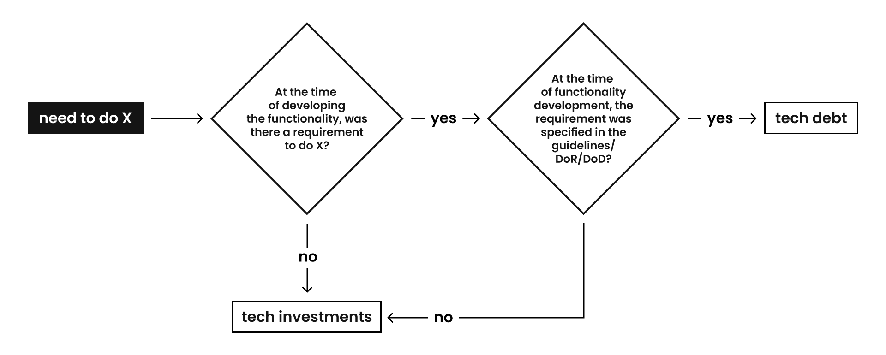
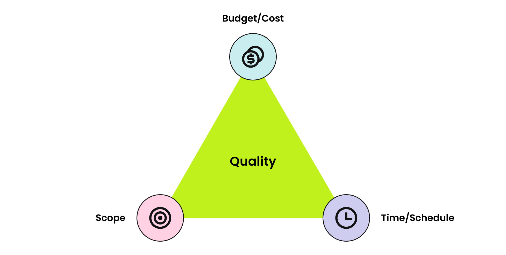

# Tech Debt & Tech Investments

## Definitions and Differences

**Technical Debt** — conscious or unconscious violation of code quality requirements (guidelines, accepted architectural decisions, other company standards) and Definition of Done (DoD) criteria in favor of faster feature development.

**Technical Investment** — any engineering activity that does not directly deliver user value but contributes to improving the quality and / or speed of development or supports further scalability and stability of the product.

The fundamental difference between technical debt and technical investment is illustrated in the flowchart below.

**Non-trivial example:** at the technology division level, a strategic decision is made to invest in automated testing. Tasks related to automated testing are considered technical investments. Once the process of writing automated tests is established, the DoD for the company includes a requirement that "tests are written for the task". The tests are written during the implementation of the task. If a specific task has been implemented without writing tests, but it needs to be released quickly, the team creates an additional task labeled "technical debt for automated testing."

## When Technical Debt Arises

As known, there is the project management triangle that defines the balance between budget, scope, and time for task implementation. Depending on the company's current needs, it may be necessary to adjust the proportions, which can lead to the emergence of technical debt.

There are three scenarios for the emergence of technical debt:

1. An engineer consciously allows deviations from development standards and / or violates the team's DoD in order to achieve faster feature deployment.
2. During code review, an engineer is pointed out to non-compliance with guidelines, but they are unable to make immediate corrections ("tight deadlines" or other objective reasons); during the review, the task is found to be non-compliant with the team's DoD criteria.
3. During a code audit, an engineer identifies discrepancies in the technical solution against accepted standards (including external audits by architects, development advocates, and engineers from other teams).

In all three scenarios, the engineer must create an additional task for technical debt to visualize and subsequently address it.

### Documentation Tech Debt

Documentation tech debt occurs when the implemented updates are not reflected in the documentation. In such cases, a tech debt task for documentation should be created and prioritized in the nearest sprints. The task is generated semi-automatically in Jira: upon closing a feature task, there is a modal window asking about the documentation's readiness. If the documentation is not ready, select "No," and a tech debt task will be created automatically.

> **NOTE**
>
> A tech debt task must be completed within the current quarter; otherwise, it lows the team maturity and service maturity levels.

## Technical Investment

Scenarios for the emergence of technical investments:

1. When implementing a product feature requires finding an innovative (never done before) technical solution.
2. When there is a need at the team / cluster / company level for a technical initiative aimed at ensuring product stability and / or scalability, or affecting development speed and / or quality.

In each scenario, the engineer must create a task for technical investment to visualize and subsequently implement it.

Usually, initiatives from scenario #2 are planned within the framework of technical OKRs for each quarter.

## How to Digitize Technical Debt and Technical Investment

To digitize these tasks, an engineer should create a task with the type "enabler" and fill in the field "backlogtype = techdebt" or "backlogtype = techinvestments".

>**CAUTION**
> 
> Do not forget to fill out the "platform" field.

For technical debt, like any other debt, a repayment period should be indicated by filling in the "Due Date" field. Additionally, engineers can mark the planned start date for working on technical debt ("Planned Start Date") to properly allocate resources in epics per quarter.

To simplify task management, engineers can create an epic for technical debt and another epic for technical investments, filling in the "backlogtype" field for each epic. This way, any new tasks created inside or linked to the epic will automatically inherit the same "backlogtype" value as the epic.

Statistics on technical debt is monitored in the following dashboards:

1. For mobile-related tech debt: at app cluster dashboards (or in Global Dashboard Jira - Global "Enablers / Tech-Debt" Roadmap).
2. For backend tech debt — in global Roadmaps in Jira:
   * Jira - Global "Enablers / Tech-Debt" Roadmap;
   * Jira - "Architecture / Deb Control" Roadmap.

Statistics on the implementation of tasks related to tech debt and tech investments are captured in the team performance dashboard under the tech investments graph. A good practice is to allocate around 20% of the team's capacity to work on technical debt and technical investments in each iteration.

## How to Handle Technical Debt and Technical Investment

1. The team should manage its technical debt. If technical debt continues to accumulate over time, the team should reassess its working agreements. The team's technical debt should strive to approach zero.
2. The team should allocate time for technical investments, both local and global (at the company level). Approximately 20% of the team's capacity should be dedicated to implementing technical investments.