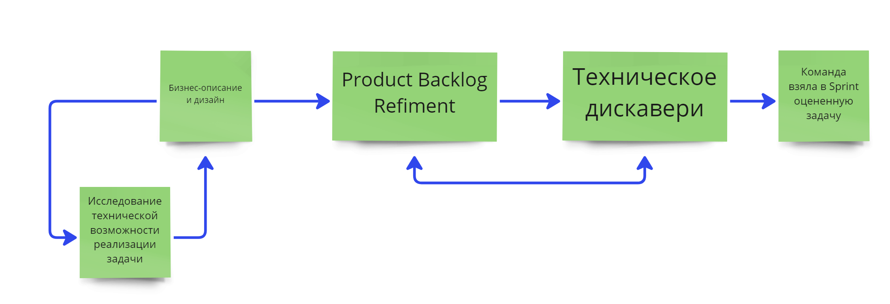

# Pre-Delivery Process (RH)

This instruction is written to understand whether everything is in order with Pre-Delivery, and if necessary, take certain steps that will help in 80% of cases.

# What is the Pre-Delivery Process?

Pre-Delivery — the process of the formation of product and tech decision, i.e. the preparation of the task to meet DoR. If you break the process into large pieces, it consists of several steps.

## Step 0

Verification of the idea (task) between software and tech lead for the possibility of implementing the idea with the help of a five-minute conversation.

**Responsible**: Product Manager.

**Goal**: to understand whether it is worth detailing the idea further or it is impossible to implement it at the moment (it will take a lot of resources).

## 1 Step

**Who**: product manager (or the person who performs the functions of the product) brings business description of the task and design to the team.

**Responsible**: product manager.

**Goal**: to convey the idea of changes to the team so that the team can challenge the idea and the value of the changes, and then start technical research or immediately give an estimate if the task is simple.

**Result**: at this stage, you can get a quick assessment from the team about the possibility of technical implementation (feasible / not feasible, can be done quickly / will take a lot of time, etc.), as well as understand which part of the team will be involved: all, iOS/Android/Backend, etc.

>**NOTE**
> 
> The business-description format is used.

* here are the user stories, the description of functional elements, and so on. The product does not describe technical details, since the development is fully responsible for the technical solution. The most important thing at this stage is to give a **comprehensive description of how it will work for business and users**. If necessary, this description can be decomposed into stages of implementation;
* how the project should work for the user and business, and the final result we expect.

* **Business description template**:
  * problem;
  * goal;
  * solution:
    * business requirements;
    * user story;
    * layouts, prototypes.
* **What should be**:
  * All major user scenarios are taken into account.
  * A clear description of how it should work for users: internal and external. We work out not only part of the application, but also, for example, the logic of admin panels, how it will work with the control center, how the deployment will take place (if it is important).
  * Examples of competitors, if possible. 
* **What should not be**:
  * Working out to every corner case (you need to think about corner cases, but it is impossible to work out each one in 100% of cases).
  * Working out technical solutions.
  * Detailed elaboration of metrics. It is not necessary to describe all metrics and counter-metrics, it is enough to understand the target metrics at the top level.
* **Positive patterns**: 
  * The team understands why the user needs this functionality, and can challenge the product idea a little.
  * There is a list of what else is missing in the business description for the team to understand how to do this task technically.
  * The development plan may already be known (what will be affected in terms of code).
* **Anti-pattern of this step**:
  * The team can not give an approximate estimate or feedback.
  * There is no design (at least drafts of layouts).
  * The task is discussed as "make a button" without understanding what it can affect, what metrics it will affect and why it is necessary to do it right now.

## 2 Step. Product Backlog Refinement

After the team together with the product owner has passed the product challenge (understood what the product wants to change and why), the task can be taken to Product Backlog Refinement (PBR).

**Product Backlog Refinement** is the process of breaking down Product Backlog items into smaller and more specific items, and further refinement. This is a full-fledged joint working session.

If after the description of the task and discussion there are mainly technical questions, then technical research begins.

**When**: at least a week before the start of the sprint. It is desirable to discuss the task for +1 sprint (that is, 2 weeks before the start of the sprint).

**Who**: the whole team meets to discuss the description of the task.

**Responsible**: product manager for bringing the idea, Agile Coach for facilitating the meeting.

**Goal**: to ask questions about the technical implementation, discuss the task together and ask ANY open questions, ideally — get an answer to them, get a plan for technical research. 

**Result**: a list of open questions, a list of action points (what to do + responsible + deadline) for further research.

**Positive patterns**:

* the team preliminarily decomposes the task and gives a preliminary estimate without research spikes.
* DoR is filled in more than 50%+ during PBR.

* **Anti-patterns of this step**:
  * PBR can not have enough data for elaboration: if the product has provided an insufficiently clear description or design, after which it is impossible to move on to the stage of technical discovery (the team decides on its own whether it is possible to take it to technical research or not), then we send the product to finish the task.

## 3 Step. Tech Discovery

**When**: finishes minimum one day before the sprint planning. 

**Who**: the development team and tech lead, if necessary, you can connect an analyst if an A/B test is required.
 
**Responsible**: tech lead for the technical part, product analyst (or product manager, if there is no analyst) for the part with metrics.

**Goal**: completed DoR and minimization of questions about technical implementation.

As the result:

* ready-made development plan (Sprint Backlog);
* decomposition of the project (tech lead is responsible);
* tasks in Jira;
* estimation of tasks in Jira (tech lead is responsible);
* plan of A/B test (if any) and events that need to be tracked (analyst is responsible);
* testing plan (QA is responsible) and acceptance criteria.

## 4 Step. Final

The team has taken a clear, decomposed and estimated task that is important for the business result.

